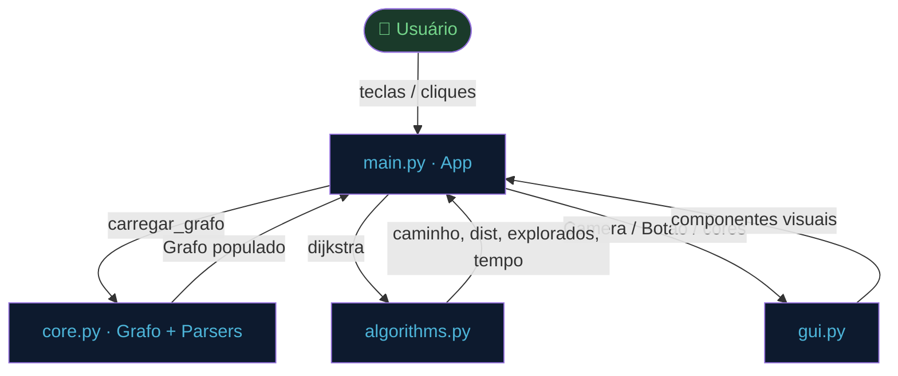
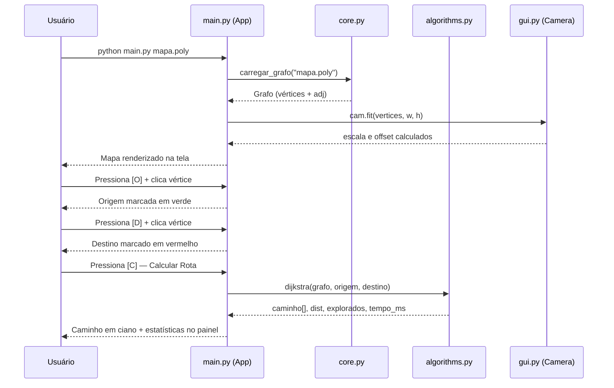

# Arquitetura do Sistema

> **Arquivo:** `02_arquitetura.md`  
> **Escopo:** Visão geral dos módulos, responsabilidades e fluxos de comunicação

---

## Visão Geral

O projeto é organizado em **quatro módulos** com responsabilidades bem definidas, seguindo o princípio de separação de preocupações. Nenhum módulo de nível inferior (dados, algoritmos, UI) conhece os detalhes dos módulos acima dele.

```
┌──────────────────────────────────────────────┐
│               main.py  (App)                 │  ← Controlador / Orquestrador
│  Pygame loop · eventos · modos · desenho     │
└────────┬──────────────┬──────────────────────┘
         │              │
         ▼              ▼
┌─────────────┐  ┌─────────────────┐
│   core.py   │  │  algorithms.py  │
│  Grafo      │  │  dijkstra()     │
│  Parsers    │  │  (stateless)    │
└─────────────┘  └─────────────────┘
         │
         ▼
┌─────────────┐
│   gui.py    │
│  Camera     │
│  Botao      │
│  Constantes │
└─────────────┘
```

---

## Responsabilidade de cada módulo

### `core.py` — Modelagem e Carregamento de Dados

- Define `Vertice` e `Grafo` (lista de adjacência)
- Parsers: `carregar_poly`, `carregar_txt`, `carregar_osm_xml`
- Detector automático de formato: `carregar_grafo`
- Utilitários: projeção geográfica, distância euclidiana

### `algorithms.py` — Algoritmos Puros

- Implementa `dijkstra(grafo, inicio, fim)`
- Sem dependência de UI ou de parsers — recebe e retorna dados simples
- Retorna: `(caminho[], distância, nós_explorados, tempo_ms)`
- Projetado para receber A\*, Bellman-Ford etc. no futuro

### `gui.py` — Componentes Visuais e Constantes

- Classe `Camera`: conversão mundo ↔ tela, zoom com pivot, fit automático
- Classe `Botao`: retângulo, hover, ativo, scroll offset
- 20+ constantes de cor (`COR_FUNDO`, `COR_CAMINHO_A`, etc.)
- Constantes de layout: `LARGURA`, `ALTURA`, `SIDEBAR_W`, `FPS`

### `main.py` — Controlador Principal (`App`)

- Inicializa Pygame, janela, fontes, câmera e botões
- Loop principal: captura eventos → atualiza estado → renderiza
- Modos de edição: origem, destino, add\_vertice, add\_aresta, add\_aresta\_dir, deletar, deletar\_aresta, pan
- Chama `carregar_grafo` e `dijkstra`; exibe resultados no painel lateral
- Exportação de imagem para clipboard multiplataforma

### `nav_grafo_ufg.py` — Launcher de Compatibilidade

```python
from main import App
if __name__ == '__main__':
    App().run()
```

Mantém compatibilidade com o nome histórico do executável.

---

## Diagrama de Dependências



---

## Fluxo de uma sessão completa



---

## Fluxo de edição interativa

```mermaid
flowchart LR
    M([Modo Ativo]) --> ORI{modo == 'origem'?}
    ORI -->|Sim| CV1[vertice_mais_proximo\nO(V)]
    CV1 --> SO[self.origem = vid]

    M --> DST{modo == 'destino'?}
    DST -->|Sim| CV2[vertice_mais_proximo\nO(V)]
    CV2 --> SD[self.destino = vid]

    M --> AV{modo == 'add_vertice'?}
    AV -->|Sim| TM[cam.tela_para_mundo\nconverte clique]
    TM --> GAV[grafo.adicionar_vertice]

    M --> AE{modo == 'add_aresta'?}
    AE -->|Sim| SEQ[1º clique: guarda u\n2º clique: adicionar_aresta u→v]

    M --> DV{modo == 'deletar'?}
    DV -->|Sim| GRV[grafo.remover_vertice]

    M --> DA{modo == 'deletar_aresta'?}
    DA -->|Sim| AMP[aresta_mais_proxima\nO(E)]
    AMP --> GRA[grafo.remover_aresta]

    style M fill:#1a3a2a,color:#74d48a
```

---

## Método `App.desenhar` — Pipeline de renderização

A cada frame (60 FPS), o seguinte pipeline é executado:

```
1. Limpar tela com COR_FUNDO
2. Desenhar arestas (adj raw)
   ├── Cor: COR_ARESTA (não-dirigida) ou COR_ARESTA_DIR (dirigida)
   └── Se aresta faz parte do caminho → COR_CAMINHO_A (ciano)
3. Desenhar vértices (círculos)
   ├── Cor: COR_VERTICE (padrão)
   ├── COR_ORIGEM (verde) se vid == self.origem
   └── COR_DESTINO (vermelho) se vid == self.destino
4. Se mostrar_ids → renderizar label de cada vértice
5. Se mostrar_pesos → renderizar peso de cada aresta
6. Desenhar sidebar (COR_SIDEBAR)
   ├── Cabeçalho com nome do arquivo
   ├── Botões (com scroll offset)
   ├── Estatísticas (distância, nós explorados, tempo)
   └── Log de mensagens coloridas
7. pygame.display.flip()
```

---

## Detalhes de implementação por módulo

### Principais métodos de `App` (`main.py`)

| Método | Função | Complexidade |
|---|---|---|
| `__init__` | Inicializa Pygame, fontes, câmera, botões | `O(1)` |
| `run` | Loop principal de eventos | — |
| `carregar_arquivo` | Delega para `core.carregar_grafo` + fit | `O(V)` |
| `executar_dijkstra` | Valida, chama dijkstra, exibe resultado | `O((V+E) log V)` |
| `handle_click` | Despacha clique para o modo ativo | `O(V)` ou `O(E)` |
| `vertice_mais_proximo` | Busca linear pelo vértice mais perto do clique | `O(V)` |
| `aresta_mais_proxima` | Distância ponto-segmento para cada aresta | `O(E)` |
| `copiar_imagem` | Exporta frame PNG para clipboard | `O(pixels)` |
| `desenhar` | Renderiza todo o frame | `O(V + E)` |
| `set_modo` | Troca modo e reconstrói botões | `O(botões)` |
| `log` | Adiciona mensagem colorida ao painel | `O(1)` |

### Principais métodos de `Camera` (`gui.py`)

| Método | Função |
|---|---|
| `mundo_para_tela(wx, wy)` | Converte coordenada do grafo para pixel na tela |
| `tela_para_mundo(sx, sy)` | Converte pixel da tela para coordenada do grafo |
| `zoom(fator, pivot_sx, pivot_sy)` | Zoom preservando o ponto sob o cursor |
| `fit(vertices, w, h)` | Calcula escala e offset para enquadrar todos os vértices |