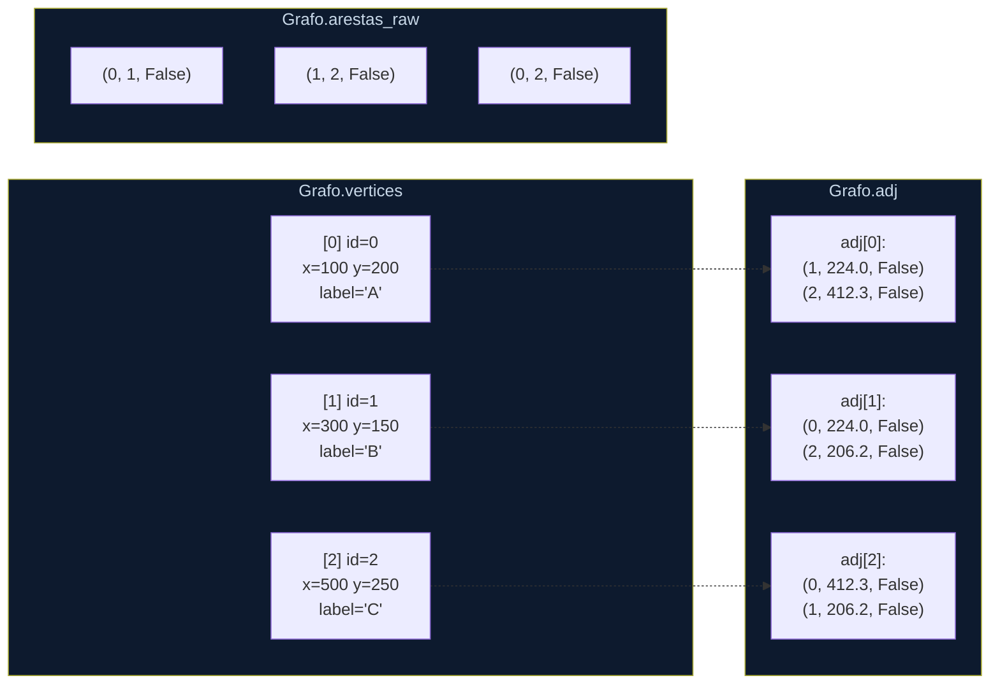

# Estruturas de Dados

> **Arquivo:** `03_estruturas_de_dados.md`  
> **Módulo principal:** `core.py`

---

## `Vertice`

Representa um nó do grafo. Usa `__slots__` para eliminar o dicionário interno de cada instância Python, reduzindo o consumo de memória.

```python
class Vertice:
    __slots__ = ('id', 'x', 'y', 'label')

    def __init__(self, id, x, y, label=None):
        self.id    = id             # índice na lista self.vertices do Grafo
        self.x     = x             # coordenada X em metros (após projeção)
        self.y     = y             # coordenada Y em metros (após projeção)
        self.label = label or id   # rótulo visual (OSM node_id ou texto)
```

**Impacto do `__slots__`:**

| | Com `__dict__` (padrão) | Com `__slots__` |
|---|---|---|
| Memória por instância | ~400–600 bytes | ~120–160 bytes |
| 10.000 instâncias | ~5 MB | ~1.4 MB |
| Acesso a atributos | via hash do dicionário | via offset fixo |

---

## `Grafo`

Estrutura central do sistema. Mantém três coleções principais:

```python
class Grafo:
    vertices: list[Vertice | None]         # [0..n-1] — None se vértice foi removido
    adj:      list[list[tuple]]            # adj[u] = [(v, peso, directed), ...]
    arestas_raw: list[tuple]               # [(u, v, directed), ...] para desenho e edição
```

### Por que `arestas_raw` além de `adj`?

- `adj` é otimizado para **travessia** (Dijkstra percorre `adj[u]` para cada u visitado).
- `arestas_raw` é mantido para **desenho** (renderiza cada aresta uma vez) e para **remoção** (localiza e remove uma aresta específica sem varrer toda a adj).

Manter as duas listas sincronizadas é responsabilidade de `adicionar_aresta` e `remover_aresta`.

---

## Diagrama da Estrutura Interna



---

## Operações do Grafo

### `adicionar_vertice(x, y, label)`

```python
def adicionar_vertice(self, x, y, label=None):
    vid = len(self.vertices)
    self.vertices.append(Vertice(vid, x, y, label))
    self.adj.append([])
    return vid
```

Complexidade: **O(1)** amortizado (append em lista Python).

---

### `adicionar_aresta(u, v, directed)`

```python
def adicionar_aresta(self, u, v, directed=False):
    d = self._dist(u, v)              # distância euclidiana
    self.adj[u].append((v, d, directed))
    if not directed:
        self.adj[v].append((u, d, directed))   # sentido reverso
    self.arestas_raw.append((u, v, directed))
    return d
```

Complexidade: **O(1)**.

O peso da aresta é calculado automaticamente como **distância euclidiana** entre as coordenadas dos dois vértices:

```python
def _dist(self, u, v):
    vu, vv = self.vertices[u], self.vertices[v]
    return math.hypot(vu.x - vv.x, vu.y - vv.y)
```

---

### `remover_aresta(u, v, directed)`

A remoção varre `arestas_raw` para localizar a aresta, então remove as entradas correspondentes de `adj[u]` (e `adj[v]` se não-dirigida):

```python
def remover_aresta(self, u, v, directed=None):
    for idx, (a, b, dr) in enumerate(self.arestas_raw):
        # ... localiza e remove
        self.arestas_raw.pop(idx)
        self.adj[a] = filtrar(self.adj[a], a, b, dr)
        if not dr:
            self.adj[b] = filtrar(self.adj[b], b, a, dr)
        return True
    return False
```

Complexidade: **O(E)** — varre a lista de arestas.

---

### `remover_vertice(vid)`

```python
def remover_vertice(self, vid):
    self.vertices[vid] = None          # marca como removido (não rearranja índices)
    self.adj[vid] = []
    for i in range(len(self.adj)):     # remove referências a vid em toda adj
        self.adj[i] = [(j, d, dr) for (j, d, dr) in self.adj[i] if j != vid]
    self.arestas_raw = [(u, v, dr) for (u, v, dr) in self.arestas_raw
                        if u != vid and v != vid]
```

Complexidade: **O(V + E)**.

> **Decisão de design:** O vértice removido é marcado como `None` em vez de reindexar o vetor inteiro. Isso evita invalidar todos os índices existentes (em `adj`, `arestas_raw`, `origem`, `destino`, `caminho`), ao custo de manter "buracos" na lista de vértices. O algoritmo de Dijkstra já trata isso com `if grafo.vertices[v] is None: continue`.

---

## Projeção Geográfica

Os mapas OSM chegam em coordenadas geográficas (latitude/longitude em graus). Para calcular distâncias em metros e renderizar corretamente, o sistema aplica uma **projeção cilíndrica equidistante** centrada na média dos nós do mapa:

```python
def _projetar_latlon(lat, lon, lat0, lon0):
    raio = 6371000.0         # raio médio da Terra em metros
    rad = math.pi / 180.0
    x = (lon - lon0) * rad * math.cos(lat0 * rad) * raio
    y = -(lat - lat0) * rad * raio
    return x, y              # coordenadas em metros, y invertido (eixo de tela)
```

Esta projeção é precisa para áreas pequenas (até ~50 km), como um campus universitário.

---

## Comparativo: Lista de Adjacência vs. Matriz

```
GRAFO DE EXEMPLO: 5 vértices, 6 arestas

Matriz de Adjacência (5×5):         Lista de Adjacência:
┌─────────────────────┐              adj[0]: [(1,1.2), (2,3.4)]
│   0  1  2  3  4    │              adj[1]: [(0,1.2), (3,2.1)]
│0  -  1.2 3.4 -  -  │              adj[2]: [(0,3.4), (4,0.9)]
│1  1.2 -  -  2.1 -  │              adj[3]: [(1,2.1)]
│2  3.4 -  -  -  0.9 │              adj[4]: [(2,0.9)]
│3  -  2.1 -  -  -   │
│4  -  -  0.9 -  -   │              Memória: O(V + E) = 11 entradas
└─────────────────────┘              vs. O(V²) = 25 células
  Memória: 25 células (muitas = 0)
```

Para o Campus UFG (V=10k, E=11.5k):
- **Matriz:** 100.000.000 células — a maioria zerada
- **Lista:** ~21.500 entradas — apenas o que existe

A lista de adjacência usa **~4.650× menos memória** neste caso.