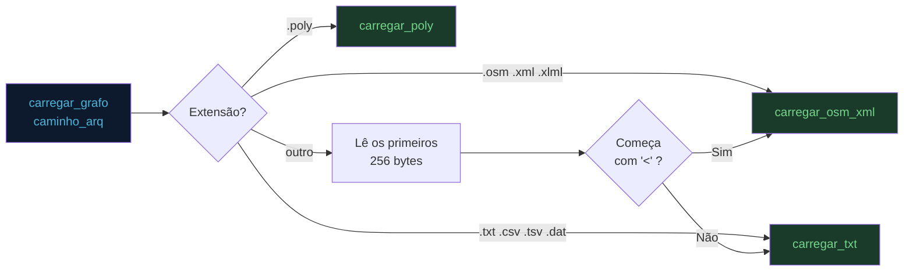

# Requisitos e Formatos de Entrada

> **Arquivo:** `06_requisitos.md`  
> **Escopo:** Requisitos funcionais, não-funcionais e especificação dos formatos de arquivo suportados

---

## Requisitos Funcionais (RF)

| ID | Requisito | Como é atendido | Módulo |
|---|---|---|---|
| RF01 | Importar mapas reais e convertê-los para grafos | `carregar_osm_xml`, `carregar_poly` | `core.py` |
| RF02 | Enumerar vértices e exibir pesos das arestas | Teclas `N` e `W`; labels e pesos renderizados no canvas | `main.py` |
| RF03 | Selecionar origem (verde) e destino (vermelho), com desfazer | Teclas `O`, `D`, `R`; feedback visual imediato | `main.py` |
| RF04 | Calcular e destacar caminho mínimo | `dijkstra` em `algorithms.py`; aresta em ciano | `algorithms.py` + `main.py` |
| RF05 | Adicionar e remover vértices e arestas interativamente | Modos `V`, `A`, `U`, `X`, `Z` via mouse | `main.py` + `core.py` |
| RF06 | Suportar arestas dirigidas e não-dirigidas | Flag `directed` em toda a estrutura do grafo | `core.py` |
| RF07 | Exibir estatísticas de execução do algoritmo | Painel lateral: nós explorados, distância total, tempo (ms) | `main.py` |
| RF08 | Exportar imagem do mapa | Tecla `I`; PowerShell / xclip / osascript; fallback PNG | `main.py` |

---

## Requisitos Não-Funcionais (RNF)

| ID | Requisito | Como é atendido | Módulo |
|---|---|---|---|
| RNF01 | Cores distintas e semânticas para elementos visuais | Paleta com 20+ constantes nomeadas (`COR_ORIGEM`, `COR_CAMINHO_A`, etc.) | `gui.py` |
| RNF02 | Interface responsiva e redimensionável | `pygame.RESIZABLE`; `_layout_botoes()` recalculado a cada resize | `main.py` |
| RNF03 | Parsers eficientes para arquivos grandes | `iterparse` + `elem.clear()` no OSM; leitura linha a linha no TXT | `core.py` |
| RNF04 | Complexidade eficiente do algoritmo principal | Dijkstra + `heapq`: `O((V+E) log V)` | `algorithms.py` |
| RNF05 | Uso eficiente de memória | `Vertice.__slots__`; lista de adjacência em vez de matriz | `core.py` |
| RNF06 | Interface intuitiva com feedback visual | Logs coloridos, hover/ativo nos botões, cores semânticas, scroll na sidebar | `gui.py` + `main.py` |
| RNF07 | Multiplataforma | Pygame (Win/Linux/macOS); exportação com fallbacks por SO | `main.py` |
| RNF08 | Código modular e manutenível | 4 módulos com responsabilidades isoladas, docstrings em todos | todos |

---

## Formatos de Entrada Suportados

### Detecção automática de formato



---

### Formato `.poly`

Gerado pelo utilitário C `LeArqOSM_e_GeraArqPoly.c`. Estrutura textual com seções de vértices e arestas:

```
<n_vertices> <n_arestas>
<id> <x> <y>
<id> <x> <y>
...
<n_arestas> <flags>
<id_aresta> <u> <v> <directed_flag>
<id_aresta> <u> <v> <directed_flag>
...
```

**Exemplo:**
```
4 4
0 100.0 200.0
1 300.0 150.0
2 500.0 250.0
3 400.0 350.0
4 0
0 0 1 0
1 1 2 0
2 2 3 0
3 3 0 1
```

---

### Formato OSM/XML (`.osm`, `.xml`, `.xlml`)

Formato padrão do **OpenStreetMap**. O parser filtra apenas elementos `<node>` e `<way>`, priorizando vias com a tag `highway`. Suporta a tag `oneway` para arestas dirigidas.

**Fragmento de exemplo:**
```xml
<?xml version="1.0" encoding="UTF-8"?>
<osm version="0.6">
  <node id="123456" lat="-16.6869" lon="-49.2648"/>
  <node id="123457" lat="-16.6871" lon="-49.2645"/>
  <way id="999">
    <nd ref="123456"/>
    <nd ref="123457"/>
    <tag k="highway" v="residential"/>
    <tag k="oneway" v="yes"/>
  </way>
</osm>
```

**Detalhes do parser (`carregar_osm_xml`):**

- Usa `ET.iterparse` em modo streaming — não carrega o XML inteiro na RAM
- Filtra vias sem tag `highway` (se houver pelo menos uma via com `highway`)
- Converte lat/lon para metros via projeção cilíndrica centrada na média dos nós
- Interpreta `oneway=yes|true|1` como aresta dirigida
- Interpreta `oneway=-1` como aresta dirigida no sentido reverso

---

### Formato TXT estruturado (`.txt`, `.csv`, `.tsv`, `.dat`)

Arquivo de texto com duas seções: `VERTICES` e `ARESTAS`. Aceita comentários com `#`, `//` ou `;`.

**Estrutura:**
```
VERTICES
<id_externo> <x> <y> [rótulo_opcional]
...

ARESTAS
<id_u> <id_v> [flag_direcao]
...
```

**Flag de direção (terceiro campo das arestas):**

| Valor | Interpretação |
|---|---|
| `0` ou ausente | Não-dirigida (mão dupla) |
| `1` | Dirigida (mão única) |
| `d`, `dir`, `directed` | Dirigida |
| `oneway`, `->` | Dirigida |

**Exemplo completo:**
```txt
# Mapa do Campus UFG — exemplo mínimo
VERTICES
0  100.0  120.0  Portaria_Principal
1  180.0  130.0  Biblioteca
2  220.0  160.0  Restaurante_Universitario
3  300.0  180.0  DCT

ARESTAS
0 1 0       // Portaria ↔ Biblioteca (mão dupla)
1 2 1       // Biblioteca → RU (mão única)
2 3 0       // RU ↔ DCT
3 0 0       // DCT ↔ Portaria
```

**Comportamento do parser (`carregar_txt`):**

- IDs externos são mapeados para índices internos sequenciais (0, 1, 2...) via `mapa_ids`
- Linhas de comentário e linhas em branco são ignoradas
- Seções são reconhecidas por palavras-chave insensíveis a maiúsculas: `VERTICES`, `VERTEX`, `NODES`, `NODOS`, `ARESTAS`, `EDGES`, `ARCOS`, `LINKS`

---

## Multiplataforma — exportação de imagem

A função `copiar_imagem` (`main.py`) exporta o frame atual do Pygame para a área de transferência do sistema operacional:

| Sistema | Método |
|---|---|
| Windows | PowerShell + `System.Windows.Forms.Clipboard.SetImage` |
| Linux | `xclip -selection clipboard -t image/png` |
| macOS | `osascript` para manipular clipboard |
| Fallback (qualquer) | Salva `grafo_NNNN.png` na pasta atual |

A operação é executada em uma **thread daemon** para não bloquear o loop de renderização.

---

## Pontos de extensão futuros

O sistema foi projetado com pontos claros de extensão:

| Extensão | Onde adicionar | Impacto |
|---|---|---|
| Algoritmo A\* | `algorithms.py` | Zero impacto nos outros módulos |
| Bellman-Ford | `algorithms.py` | Para grafos com pesos negativos |
| Floyd-Warshall | `algorithms.py` | Caminho mínimo entre todos os pares |
| R-tree para busca espacial | `main.py` | Reduz `vertice_mais_proximo` de O(V) para O(log V) |
| Parser GTFS | `core.py` | Mapas de transporte público |
| Exportação para JSON/GeoJSON | `core.py` | Interoperabilidade com outras ferramentas |