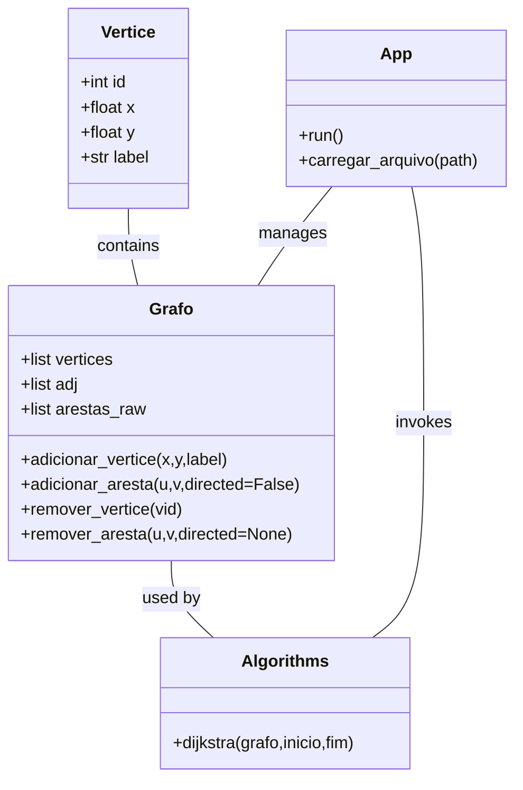
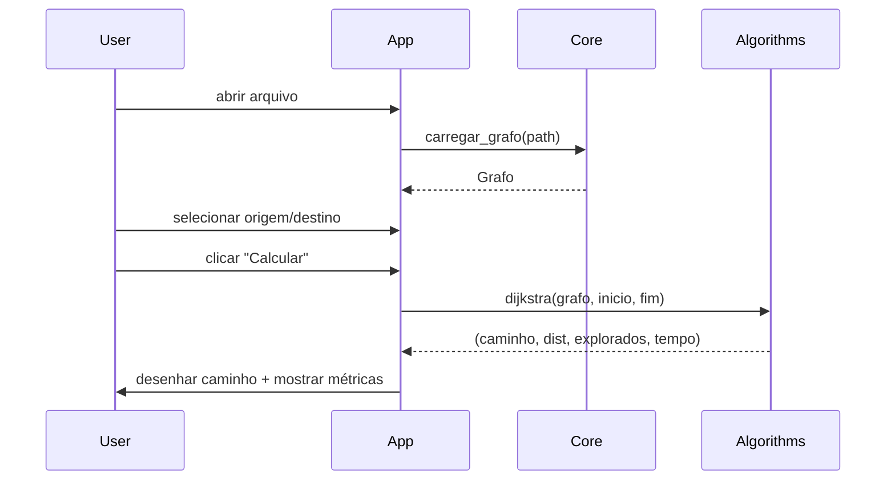

**Documento de Engenharia de Software — NavGrafo UFG (versão Python)**

Resumo
- Escopo: documentação de engenharia focada exclusivamente na pasta `versao Python`.
- Objetivo: descrever estruturas de dados, justificativas de projeto, análise de complexidade, arquitetura da GUI, práticas de engenharia adotadas, testes, métricas, e diagramas UML para apresentação.

1. Contexto e Escopo
- Este documento cobre os módulos Python: [versao Python/main.py](versao%20Python/main.py), [versao Python/core.py](versao%20Python/core.py#L1-L200), [versao Python/algorithms.py](versao%20Python/algorithms.py#L1-L200) e [versao Python/gui.py](versao%20Python/gui.py). Não cobre versões C ou JS.

2. Resumo Arquitetural
- Componentes principais:
  - Loader: `core.carregar_grafo` e subfunções (`carregar_poly`, `carregar_txt`, `carregar_osm_xml`).
  - Modelo de Dados: `Vertice`, `Grafo` (lista de adjacência + `arestas_raw`).
  - Algoritmos: `algorithms.dijkstra` (algoritmo de menor caminho com heap).
  - Interface: `main.App` (loop Pygame) + `gui` (Botao, Camera, constantes visuais).

3. Estruturas de Dados: descrição, motivos e alternativas

3.1 `Vertice`
- Estrutura: classe com `__slots__ = ('id', 'x', 'y', 'label')`.
- Motivo: `__slots__` reduz overhead de memória por instância; adequado para milhares de vértices.
- Uso: armazenar coordenadas projetadas e rótulo.

3.2 `Grafo`
- Representação: três coleções principais:
  - `vertices`: lista indexada (cada posição contém `Vertice` ou `None`).
  - `adj`: lista de listas — `adj[u] = [(v, d, directed), ...]`.
  - `arestas_raw`: lista de `(u, v, directed)` preservando a ordem original.
- Motivos:
  - Lista de adjacência: eficiente para grafos esparsos (memória e iteração sobre vizinhos).
  - `arestas_raw`: simplifica desenho da GUI (mantém ordem/identidade das arestas) e operações de edição (remoção por índice/visualização).
- Alternativas consideradas e trade-offs:
  - Matriz de adjacência: ruim para mapas grandes (E << V^2), memória proibitiva.
  - Dicionários/Mapas: permitiria vértices com ids não contínuos, mas com overhead maior; já existe mapeamento de ids externos em `carregar_txt`.
  - Estruturas espaciais (R-tree, k-d tree): recomendadas como extensão para acelerar consultas espaciais (busca de vértice/aresta próximos), não necessárias para mapas muito pequenos.

4. Operações e Complexidade
- A seguir as operações principais, com custo assintótico (V=|V|, E=|E|):
  - Adicionar vértice: O(1) (append em `vertices` e `adj`).
  - Adicionar aresta: O(1) amortizado (append em listas); cálculo de distância é O(1).
  - Remover vértice: O(V + E) no pior caso (marca `vertices[vid]=None` e filtra todas as listas de adjacência).
  - Remover aresta: O(E) para encontrar e filtrar a primeira ocorrência em `arestas_raw` e `adj` associadas.
  - Busca de vértice/aresta mais próxima (GUI): O(V) ou O(E) — varredura completa.
  - Dijkstra (algorithms.dijkstra): tempo O((V + E) log V), espaço O(V + E).

5. Algoritmos

5.1 Dijkstra (implementação)
- Implementado com `heapq`. Retorna `(caminho, distancia_total, nos_explorados, tempo_ms)`.
- Early exit: interrompe ao extrair `fim` do heap, reduzindo exploração em muitos cenários.

5.2 Recomendação: A*
- A* substitui fila prioritária com f=g+h, onde h é heurística admissível (ex.: distância euclidiana). Para mapas geográficos, heurística euclidiana é admissível e reduz nós explorados significativamente.

6. GUI — arquitetura e fluxo

6.1 Componentes
- `App` (`main.App`): inicializa Pygame, cria `Camera`, carrega grafo, mantém estado (origem, destino, modo), loop principal.
- `Camera` (`gui.Camera`): transforma coordenadas mundo ↔ tela, controla zoom/pan.
- `Botao`: encapsula desenho e eventos de UI.

6.2 Loop de evento
- Padrão: while running: processar eventos → atualizar estado → desenhar (double-buffer via Surface) → tick(FPS).
- Eventos principais: MOUSEBUTTONDOWN (seleção, pan, adicionar/remover), KEYDOWN (atalhos), VIDEORESIZE.

6.3 Desenho e seleção
- Desenho das arestas: usa `arestas_raw` para manter ordem visual.
- Seleção de vértice: `vertice_mais_proximo` percorre `vertices`, converte ponto de tela para mundo e escolhe menor d2.
- Seleção de aresta: calcula distância ponto-segmento para cada aresta — função `_distancia_ponto_segmento`.

6.4 Problemas de escala e solução proposta
- Operações O(V) / O(E) por interação não escalam. Solução: indexar vértices/arestas com R-tree (por exemplo `rtree` ou `shapely.strtree`) e limitar candidatos pela caixa de busca.

7. Engenharia de Software aplicada

7.1 Princípios observados
- Separação de responsabilidades (SRP): `core` (modelo e IO), `algorithms` (lógica de busca), `gui/main` (apresentação e interação).
- Modularidade: módulos isolados permitem testes unitários específicos.
- Leitura em streaming (OSM): boa prática para arquivos grandes (uso de `iterparse` e `elem.clear()`).

7.2 Testes
- Unit tests sugeridos:
  - `core`: carregar arquivos `.poly`, `.txt`, `.osm` (pequenos fixtures) e checar contagem de vértices/arestas e posições.
  - `algorithms`: testar `dijkstra` em grafos pequenos (linha reta, grafo desconexo, ciclo) com asserts nos resultados e nas métricas (`nos_explorados`).
  - `gui` helpers: testar `Camera` transformações `mundo_para_tela` / `tela_para_mundo` com valores conhecidos.
- Ferramentas: `pytest`, coverage.

7.3 Integração contínua (sugestão)
- GitHub Actions pipeline básico:
  - `python -m pip install -r requirements.txt` (incluir `pygame` em extras de dev se necessário).
  - `pytest --maxfail=1 --disable-warnings -q`.
  - Opcional: executar linter (`flake8`/`ruff`) e `mypy` (se houver typing).

7.4 Logs e Telemetria
- `main.App.log` já coleta mensagens para exibir; adicionar opcionalmente logging estruturado (`logging` module) para testes e CI, e flag `--profile` para coletar métricas por execução.

8. Plano de Testes e Métricas
- Casos de teste: pequeno (V~100), médio (V~1k), grande (V>10k — usar OSM chunked).
- Métricas a coletar: tempo total, nós explorados, memória (rss), número de operações de I/O.
- Scripts de benchmark: criar `benchmarks/run_bench.py` que carrega mapa, executa rota N vezes e registra média/std.

9. Diagramas UML (Mermaid)

Class diagram:



Sequence diagram (carregar mapa e executar Dijkstra):



10. Recomendações de melhorias e roadmap
- Curto prazo:
  - Implementar A* e adicionar opção na GUI para comparar (dijkstra vs a*), com visualização dos nós explorados.
  - Adicionar testes unitários e benchmark scripts.
- Médio prazo:
  - Integrar R-tree (shapely/rtree) para acelerar seleção de vértices/arestas.
  - Adicionar perfilamento automático (cProfile) e CI que coleta benchmarks.
- Longo prazo:
  - Suportar atributos de arestas (tempo, velocidade, peso) e rotas multi-critério.

11. Instruções rápidas
- Rodar app (Windows PowerShell):

```powershell
python -m pip install pygame
cd "versao Python"
python main.py
```


